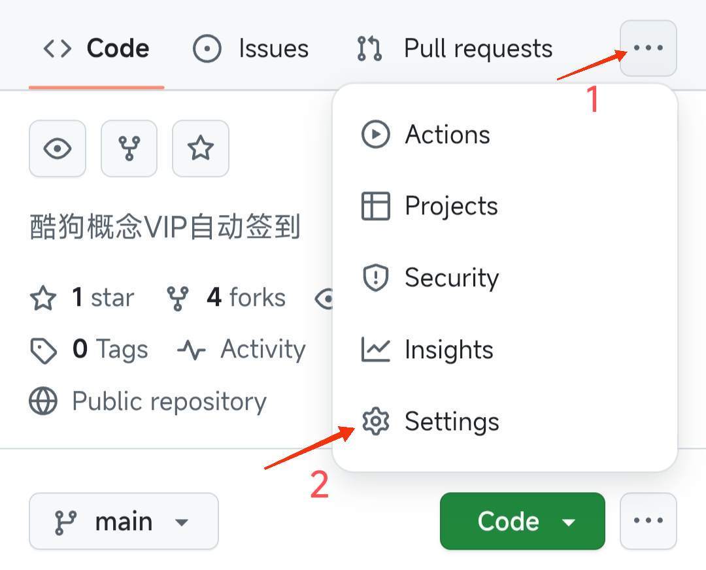
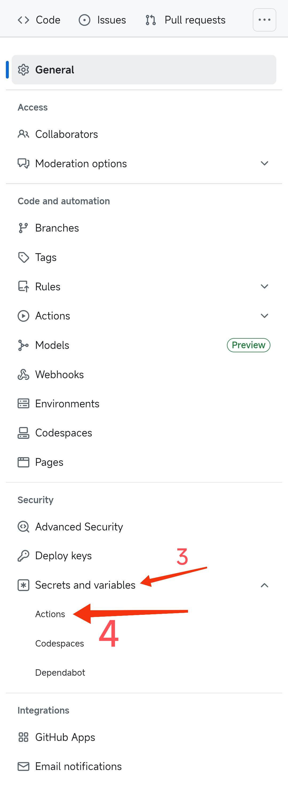
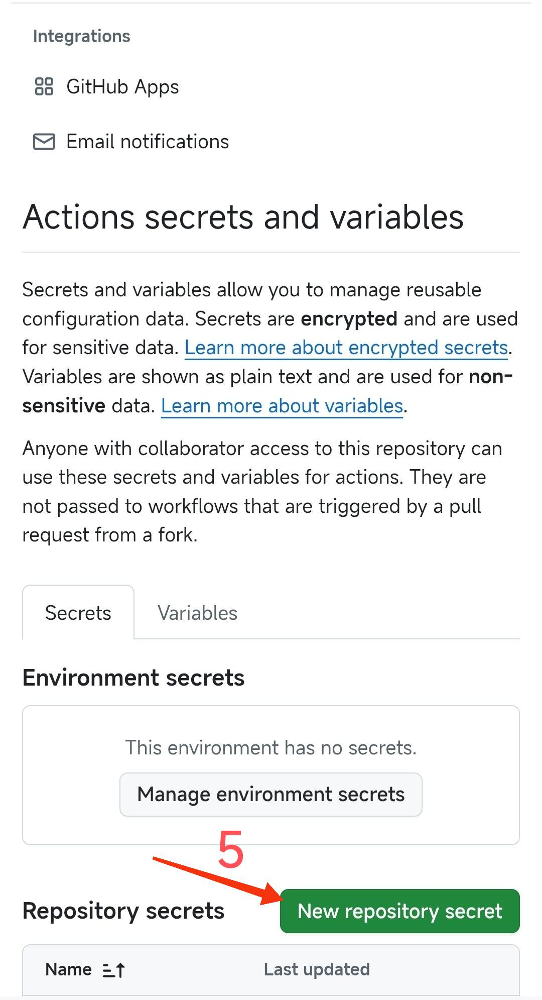
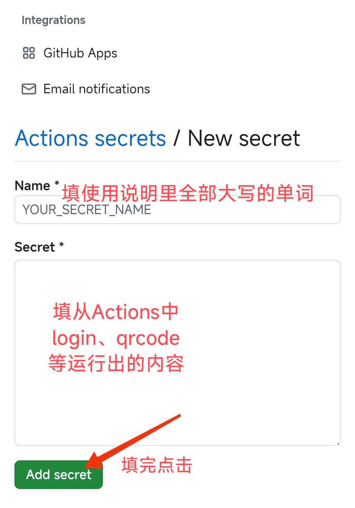

> [!CAUTION]
> 这个是克隆项目，原项目地址在 [kgcheckin](https://github.com/develop202/kgcheckin.git)

# 酷狗签到

GitHub Actions 实现 `酷狗概念VIP` 自动签到
每天领取总计 `两天酷狗概念VIP`

提供二维码登录(推荐)和手机号登录(一个手机号绑定多个账号无法登录,见 [多账号登录问题](https://github.com/MakcRe/KuGouMusicApi/issues/51))

> [!warning]
> 注意事项
>
> 1. 登录每2个月会过期一次，过期后需要重新登录才可继续签到。
> 1. 若登录后listen签到失败，可以到APP 活动中心->天天签到领VIP 查看当日是否已经领取VIP(新版APP的领取未来会员时长的活动不要领)。运行成功后就不要在APP签到。
> 1. 可以只在APP听歌，不领取VIP相关的奖励，减少对签到的影响(鬼知道官方后续会推出什么奇葩活动)。
> 1. 下面是部分已知错误码
>
> | 错误码 | 描述       |
> | ------ | ---------- |
> | 51002  | 未登录     |
> | 20018  | 未登录     |
> | 130012 | 已领取     |
> | 30002  | 次数已用光 |

## 免责声明

> [!important]
>
> 1. 本项目仅供学习使用，请尊重版权，请勿利用此项目从事商业行为及非法用途!
> 2. 使用本项目的过程中可能会产生版权数据。对于这些版权数据，本项目不拥有它们的所有权。为了避免侵权，使用者务必在 24小时内清除使用本项目的过程中所产生的版权数据。
> 3. 由于使用本项目产生的包括由于本协议或由于使用或无法使用本项目而引起的任何性质的任何直接、间接、特殊、偶然或结果性损害（包括但不限于因商誉损失、停工、计算机故障或故障引起的损害赔偿，或任何及所有其他商业损害或损失）由使用者负责。
> 4. **禁止在违反当地法律法规的情况下使用本项目。** 对于使用者在明知或不知当地法律法规不允许的情况下使用本项目所造成的任何违法违规行为由使用者承担，本项目不承担由此造成的任何直接、间接、特殊、偶然或结果性责任。
> 5. 音乐平台不易，请尊重版权，支持正版。
> 6. 本项目仅用于对技术可行性的探索及研究，不接受任何商业（包括但不限于广告等）合作及捐赠。
> 7. 如果官方音乐平台觉得本项目不妥，可联系本项目更改或移除。

## 使用说明

两种登录方式任选其一，同时使用两种登录则优先二维码登录

1. Fork 本仓库

1. 登录方式

   2.1 二维码(推荐)

   运行 Actions `QRcode` 成功后复制key和二维码链接，二维码链接粘到浏览器打开，用酷狗概念版扫描并确认登录(二维码过期较快，请尽快扫码确认)。确认登录后把key添加到 Secret `KEY` （什么？不知道 Secret在哪？[点我](#secret)）

   2.2 手机号

   添加手机号到 Secret `PHONE`，运行 Actions `sent` 获取验证码，添加收到的验证码到 Secret `CODE`

1. 运行 Actions `login` 成功后复制 `token` 和 `userid`并添加到 Secret `TOKEN` `USERID`

1. 启用 Actions `run` 和 `listen`, 每天北京时间 00:01 自动签到

API源代码来自 [MakcRe/KuGouMusicApi](https://github.com/MakcRe/KuGouMusicApi) ~~图省事直接搬来~~

## Secret

1. 步骤一
   
1. 步骤二
   
1. 步骤三
   
1. 步骤四
   
